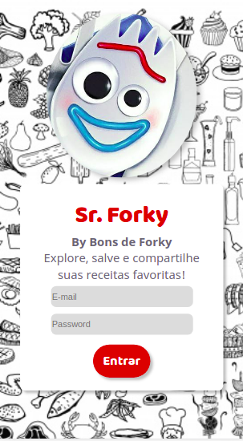
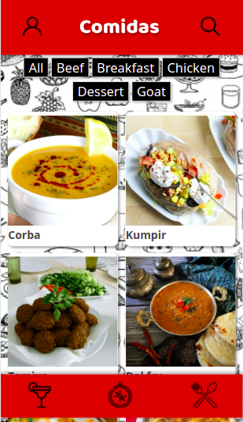
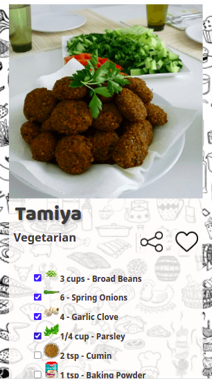

# Boas vindas ao repositório do projeto de Receitas!

## https://trybe-recipe-app.vercel.app/

<><>

# Habilidades

Nesse projeto, você será capaz de:

  - Utilizar Redux para gerenciar estado
  - Utilizar a biblioteca React-Redux
  - Utilizar a Context API do React para gerenciar estado
  - Utilizar o React Hook useState
  - Utilizar o React Hook useContext
  - Utilizar o React Hook useEffect
  - Criar Hooks customizados

---

